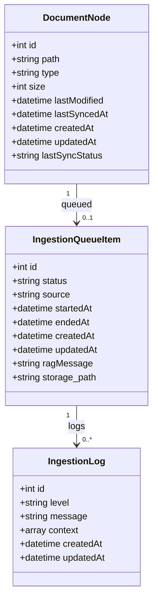
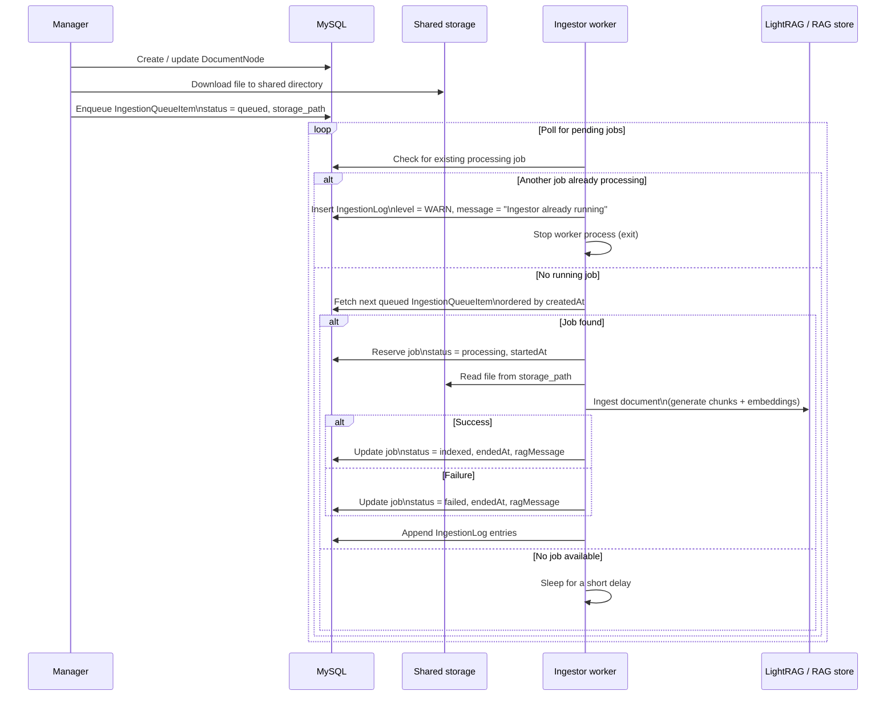

# RedwanK/rag-manager connection

The goal is to connect RedwanK/rag-ingestor (ingestor) to RedwanK/rag-manager (manager). The manager handles documents that will be ingest and added to the RAG. The ingestor create and update the RAG with the files given by the manager.

## Data synchronisation

Both projects will be connected to the same database (MySQL). The data model comes from the manager repository, the projects will share the following classes :

The ingestor needs to implement this data model using SQLAlchemy to facilitate the connection to the database.

## Files synchronisation

During the manager's enqueuing process, the corresponding file is downloaded and placed inside a shared directory. The relative path to this file is stored in the "storage_path" attribute of IngestionQueueItem. The path to this directory is stored in an env variable (.env) in the ingestor. The ingestor will use this file to ingest it later. 

## Synchronized ingestion workflow

The ingestion subsystem is implemented as a single long-running worker (the Ingestor) responsible for processing file ingestion jobs sequentially. Due to limited hardware resources and the high computational cost of generating embeddings locally, the system enforces strict single-job concurrency, ensuring that no two ingestion processes run simultaneously.

The Ingestor periodically polls the shared MySQL database to retrieve pending ingestion jobs created by the Manager application. Before reserving any new job, it first checks whether another `IngestionQueueItem` is already in `processing` status. If such a job exists, the worker writes a warning entry in `IngestionLog` to record that a second ingestor tried to start while one was already running, then stops its process without reserving or processing any job. Polling is purposely lightweight: if no job is available and no running job is detected, the worker sleeps for a short period before checking again. When a job is found (the next `queued` item ordered by `createdAt`), the worker reserves it by switching its status to `processing`, processes it, and updates its status to either `indexed` (success) or `failed` (error) accordingly.

This design avoids unnecessary CPU load, prevents parallel execution of resource-intensive tasks, and guarantees robust recovery in case of unexpected worker crash or interruption.

