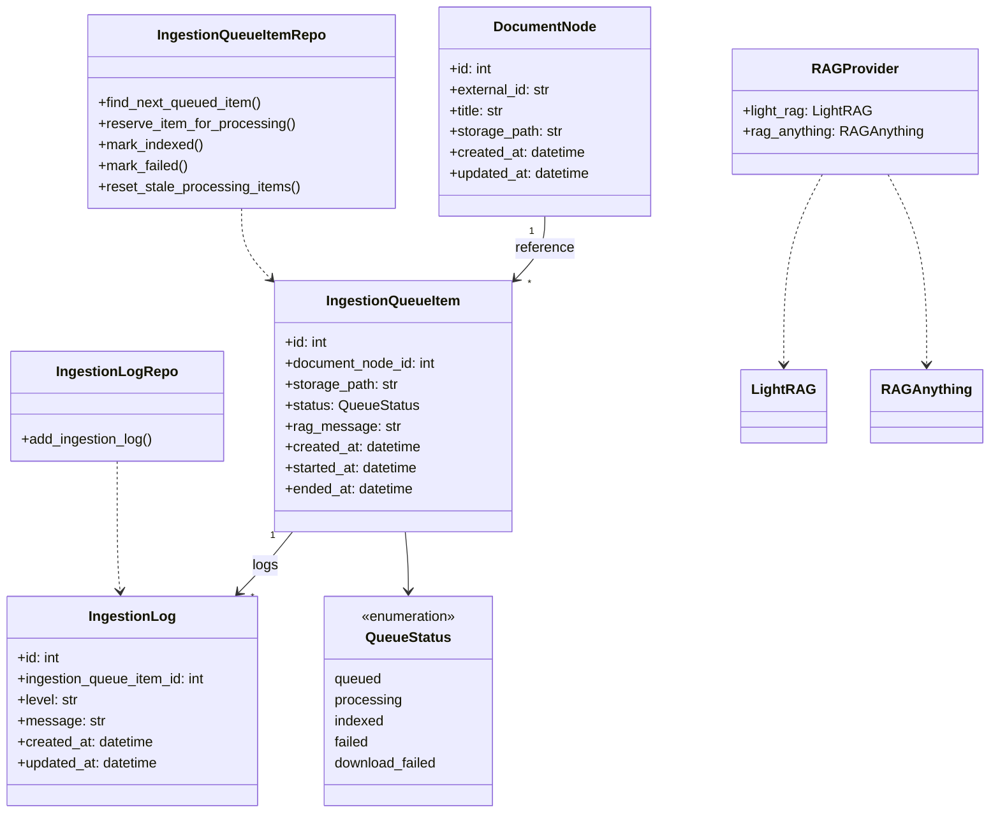

# Diagramme de classes

Ce diagramme met en avant les relations entre les entités SQLAlchemy, les repositories et les services clés utilisés par le worker et l'ingestor.

```mermaid
classDiagram
    class DocumentNode {
        +id: int
        +external_id: str
        +title: str
        +storage_path: str
        +created_at: datetime
        +updated_at: datetime
    }

    class IngestionQueueItem {
        +id: int
        +document_node_id: int
        +storage_path: str
        +status: QueueStatus
        +rag_message: str
        +created_at: datetime
        +started_at: datetime
        +ended_at: datetime
    }

    class IngestionLog {
        +id: int
        +ingestion_queue_item_id: int
        +level: str
        +message: str
        +created_at: datetime
        +updated_at: datetime
    }

    class QueueStatus {
        <<enumeration>>
        queued
        processing
        indexed
        failed
        download_failed
    }

    class IngestionQueueItemRepo {
        +find_next_queued_item()
        +reserve_item_for_processing()
        +mark_indexed()
        +mark_failed()
        +reset_stale_processing_items()
    }

    class IngestionLogRepo {
        +add_ingestion_log()
    }

    class RAGProvider {
        +light_rag: LightRAG
        +rag_anything: RAGAnything
    }

    DocumentNode "1" --> "*" IngestionQueueItem : reference
    IngestionQueueItem "1" --> "*" IngestionLog : logs
    IngestionQueueItem --> QueueStatus
    IngestionQueueItemRepo ..> IngestionQueueItem
    IngestionLogRepo ..> IngestionLog
    RAGProvider ..> LightRAG
    RAGProvider ..> RAGAnything
```
