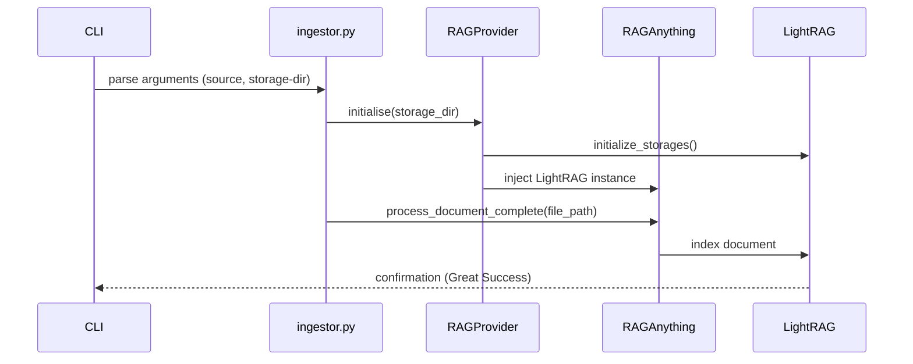
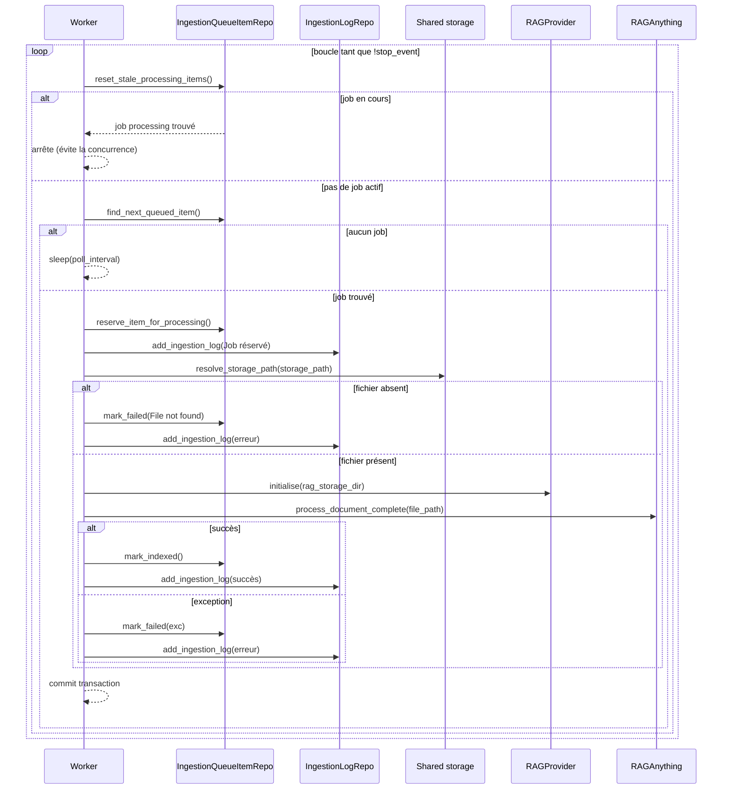

# Diagrammes de séquence

## Ingestion ponctuelle (`rag-ingest single`)

```mermaid
sequenceDiagram
    participant CLI
    participant Ingestor as ingestor.py
    participant RAGProvider
    participant RAGAnything
    participant LightRAG

    CLI->>Ingestor: parse arguments (source, storage-dir)
    Ingestor->>RAGProvider: initialise(storage_dir)
    RAGProvider->>LightRAG: initialize_storages()
    RAGProvider->>RAGAnything: inject LightRAG instance
    Ingestor->>RAGAnything: process_document_complete(file_path)
    RAGAnything->>LightRAG: index document
    LightRAG-->>CLI: confirmation (Great Success)
```

## Worker synchronisé (`rag-ingest worker`)

```mermaid
sequenceDiagram
    participant Worker
    participant Repo as IngestionQueueItemRepo
    participant LogRepo as IngestionLogRepo
    participant Storage as Shared storage
    participant RAGProvider
    participant RAGAnything

    loop boucle tant que !stop_event
        Worker->>Repo: reset_stale_processing_items()
        alt job en cours
            Repo-->>Worker: job processing trouvé
            Worker-->>Worker: arrête (évite la concurrence)
        else pas de job actif
            Worker->>Repo: find_next_queued_item()
            alt aucun job
                Worker-->>Worker: sleep(poll_interval)
            else job trouvé
                Worker->>Repo: reserve_item_for_processing()
                Worker->>LogRepo: add_ingestion_log(Job réservé)
                Worker->>Storage: resolve_storage_path(storage_path)
                alt fichier absent
                    Worker->>Repo: mark_failed(File not found)
                    Worker->>LogRepo: add_ingestion_log(erreur)
                else fichier présent
                    Worker->>RAGProvider: initialise(rag_storage_dir)
                    Worker->>RAGAnything: process_document_complete(file_path)
                    alt succès
                        Worker->>Repo: mark_indexed()
                        Worker->>LogRepo: add_ingestion_log(succès)
                    else exception
                        Worker->>Repo: mark_failed(exc)
                        Worker->>LogRepo: add_ingestion_log(erreur)
                    end
                end
                Worker-->>Worker: commit transaction
            end
        end
    end
```
